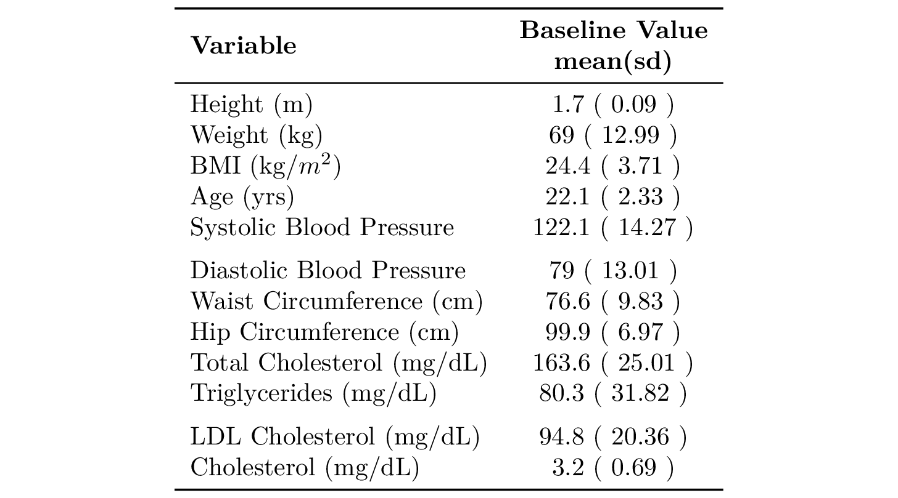
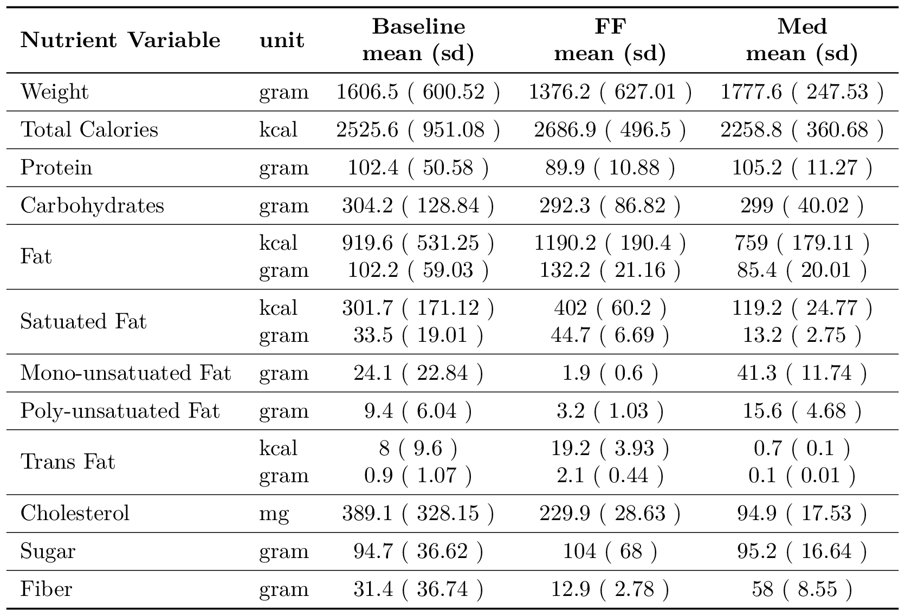
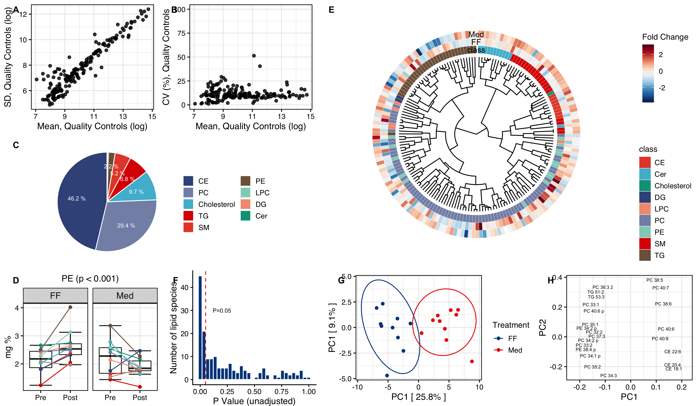
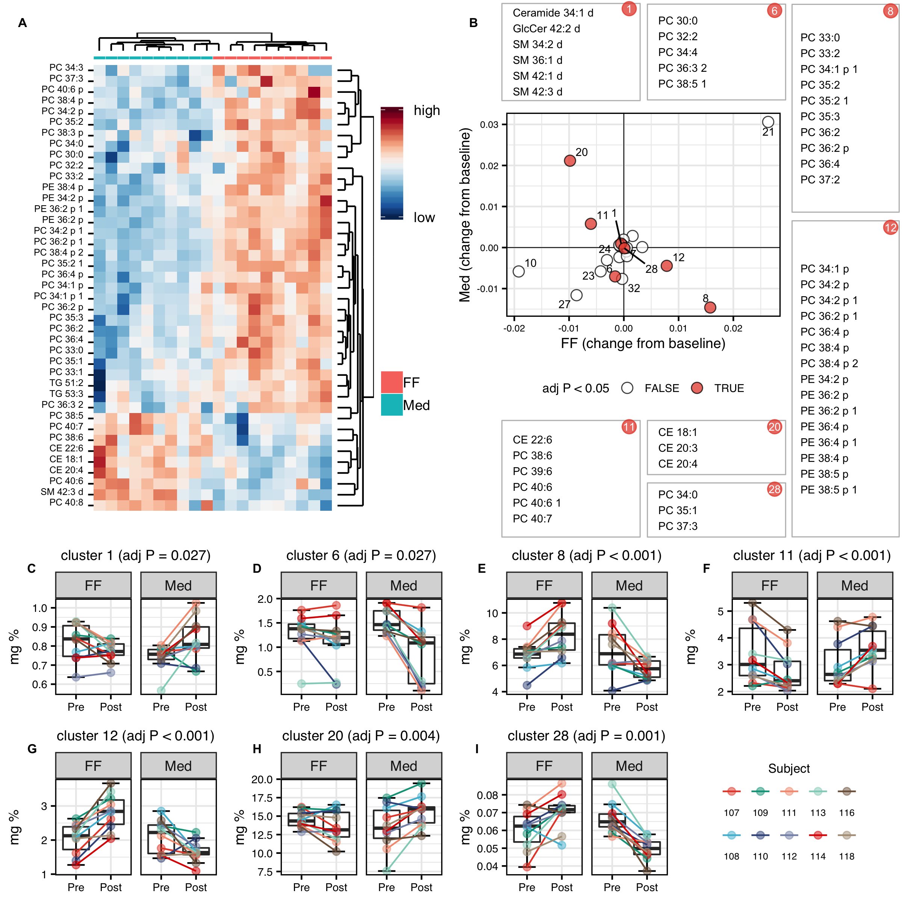
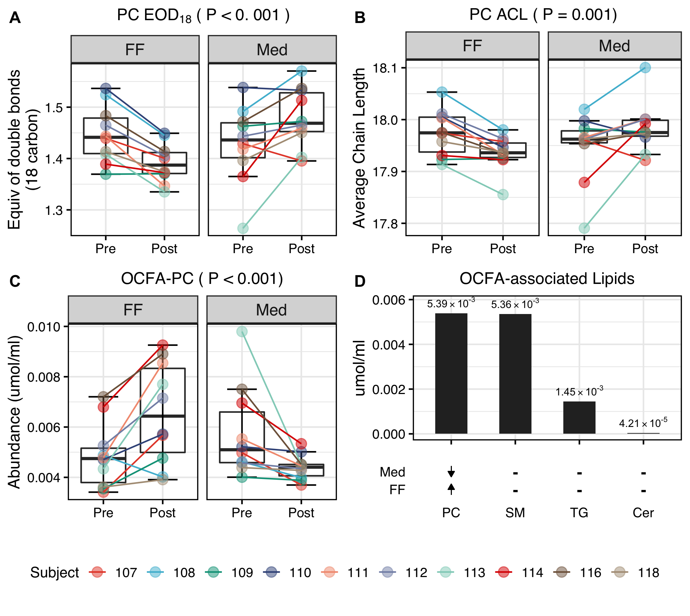

# TABLES AND FIGURES {#tables}

**Table 1**: Subject baseline characters (n=10)

```{r}

```

######

**Table 2**: Macronutrient composition of diet at baseline and after dietary treatment.

```{r}

```

######
<!-- figure 1 -->

```{r lpd-class, fig.cap="A&B: The mean versus standard deviation (A), and the mean versus coefficient of variance (B) of lipid species detected in quality control samples. Each point represents a lipid species. C: A pie chart of HDL lipid classes (mg %). D: Box plots of PE in relative abundance (mg %) for subjects before and after FF and Med diets, with unadjusted P-values. Lines with the same color represent the same subjects. E: Cladogram of all 170 lipid species detected. The dendrogram was drawn by calculating the pairwise Tanimoto structural similarity coefficient between any two lipid species. The most inner layer color bar represents the corresponding lipid class of each tree tip. The two outer layers represent the fold change of the corresponding lipid species after FF or Med.  F: Histogram of p-values (unadjusted) of each lipid species. The p-values were calculated using linear mixed model. G&H: PCA and loading plot of 44 selected lipid features with p < 0.05 after Benjamini-Hochberg adjustment."}

```

######
<!-- figure 2 -->

```{r lpd-species, fig.cap="A: Heatmap of the change (post - pre) of proportions of lipid species after FF and Med from baseline. The p-values of the 44 lipid species are less than 0.05 after Benjamini-Hochberg adjustment. B: Scatter plot of the change (post - pre) of lipid species clusters after FF versus Med. The clustering was preformed using hierarchical clustering, and lipid species within each cluster were aggregated to obtain a value for each cluster before and after FF and Med. C-I: Box plots of the relative abundance (mg %) of the 7 clusters with p < 0.05 after Benjamini-Hochberg adjustment. Lines with the same color represent the same subjects."}

```

######
<!-- figure 3 -->

```{r lpd-eod, fig.cap="A-C: Box plots of PC equivalent of double bonds (A), average chain length (B), and the mole concentration of OCFAs in PC (C) before and after FF and Med. D: Baseline mole concentration (μmol/ml) of OCFAs in PC, SM, TG, and Cer and how they responded to FF and Med."}

```


