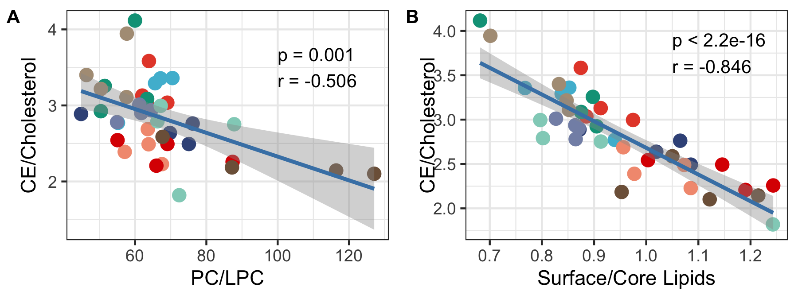

<!--- Define Headers and Footers --->
\fancypagestyle{plain}{%
  \renewcommand{\headrulewidth}{0pt}%
  \fancyhf{}%
  \fancyfoot[C]{\footnotesize Page \thepage\, of\, \pageref*{LastPage}}
  \setlength\footskip{0pt}
}
\pagestyle{plain}

```{r setup, include=FALSE}
knitr::opts_chunk$set(echo = FALSE, warning = FALSE, message = FALSE,
                      error = FALSE)
```

```{r}
# This is setting the directory to the jdk version required by rJava.
# For more information see http://chenghaozhu.net/posts/en/2019-07-07/
Sys.setenv(JAVA_HOME='/Library/Java/JavaVirtualMachines/jdk-11.0.1.jdk/Contents/Home')
pkgs = c('dplyr','stringr','reshape2', 'tibble', "Metabase", 'tabulizer', 
         "knitr", "kableExtra")
for(pkg in pkgs){
    library(pkg, quietly=TRUE, verbose=FALSE, warn.conflicts=FALSE, 
            character.only=TRUE)
}
load("data/data.rda")
```

# Supplemental Data:

\begin{center}
\begin{spacing}{2}
\textbf{The HDL lipidome is widely remodeled by fast food vs. Mediterranean diet in four days}
\newline
\newline
Chenghao Zhu\textsuperscript{a}, Lisa Sawrey-Kubicek\textsuperscript{a}, Elizabeth Beals\textsuperscript{a}, Riley L. Hughes\textsuperscript{a}, \newline Chris H. Rhodes\textsuperscript{a}, Romina Sacchi\textsuperscript{a}, Angela M. Zivkovic\textsuperscript{a}
\newline
\newline
\textsuperscript{a}Department of Nutrition, University of California, Davis, Davis, CA, USA 95616\newline
\end{spacing}
\end{center}

\newpage

**Supplemental Table S1:** Study diet menu on the FF arm (2000 kcals/day).

```{r}
ff = extract_tables("data/Fast Food Diet Meal Plan_for participants_3.23.2016_clean.pdf")[[1]]
colnames(ff) = ff[1,]
ff = ff[-1,]
ff = as.tibble(ff) %>% as.data.frame %>%
    mutate_all(function(x) gsub("\r", "\n", x)) %>%
    mutate_all(linebreak)
colnames(ff) = linebreak(gsub("\r", "\n", colnames(ff)))

kable(ff, format = "latex", booktabs = TRUE, escape = FALSE) %>%
    kable_styling(latex_options = c("striped", "hold_position")) %>%
    column_spec(1, width = "2cm") 
```

\newpage

**Supplemental Table S2:** Study diet menu on the Med arm (2000 kcals/day).
```{r}
med = extract_tables("data/2000_Healthy Diet meal Plan_Med.pdf")[[1]]
colnames(med) = med[1,]
med = med[-1,]
med = med[-6,]
med = as.tibble(med) %>% as.data.frame %>%
    mutate_all(function(x) gsub("\r", "\n", x)) %>%
    mutate_all(function(x) gsub("(\\d+)%", "\\1\\\\%", x)) %>%
    mutate_all(linebreak)
#colnames(med) = linebreak(gsub("\r", "\n", colnames(med)))

kable(med, format = "latex", booktabs = TRUE, escape = FALSE) %>%
    kable_styling(latex_options = c("striped", "HOLD_position"), 
                  font_size = 8, position = "center") %>%
    column_spec(1, width = "1.5cm")
```

Study Salad 1 = 2 cups romaine (11 cal) + ½ cup chopped grape tomatoes (16 cal) + ½ cup quinoa (111) + ½ cup chickpeas (73 cal) + 1 tbsp sunflower seeds (47 cal) \newline
Study Salad 2 = 2 cups romaine + ½ cup chopped grape tomatoes + ½ cup quinoa + ½ cup chickpeas + 2 tbsp sunflower seeds (93 cal)\newline
Study Dressing = 1 tbsp olive oil (119 cal) + 1 tbsp balsamic (14 cal)

\newpage

**Supplemental Table S3:** The relative abundance (mg %) of lipid species before and after treatments, and their statistical p values.
```{r, results="asis"}
lpd = data$data$lpd$feature$Proportion
lm = data$limma$lpd$feature$Proportion[,c("pvalue", "padj")] %>%
    rownames_to_column("variable")
df = lpd$conc_table %>%
    t %>% as.tibble %>% as.data.frame %>%
    mutate(
        Treatment = lpd$sample_table$Treatment,
        Timepoint = lpd$sample_table$Timepoint,
        Subject = lpd$sample_table$Subject
    ) %>%
    melt(id.var = c("Treatment", "Timepoint", "Subject")) %>%
    group_by(Treatment, Timepoint, variable) %>%
    summarize(value = mean(value)) %>% 
    mutate(value = ifelse(
        value >= 0.001, 
        round(value, 3),
        format(value, scientific = T, digits = 2)
    )) %>%
    dcast(variable ~ Treatment + Timepoint) %>%
    arrange(variable) %>% 
    left_join(lm) %>%
    mutate(
        pvalue = ifelse(
            pvalue >= 0.05,
            round(pvalue, 3),
            ifelse(
                pvalue >= 0.01,
                paste(round(pvalue, 3), "*"),
                ifelse(
                    pvalue >= 0.001,
                    paste(round(pvalue, 3), "**"),
                    paste(format(pvalue, scientific = T, digits = 2), "***")
                )
            )
        ),
        padj = ifelse(
            padj >= 0.05,
            round(padj, 3),
            ifelse(
                padj >= 0.01,
                paste(round(padj, 3), "*"),
                ifelse(
                    padj >= 0.001,
                    paste(round(padj, 3), "**"),
                    paste(format(padj, scientific = T, digits = 2), "***")
                )
            )
        )
    )

kable(df, format = "latex", booktabs = TRUE, longtable = TRUE) %>%
    kable_styling(latex_options = c("striped", "hold_position"), full_width = T) %>%
    column_spec(1, width = "3cm")
```
\* P value < 0.05 \newline
** P value < 0.01 \newline
*** P value < 0.001 \newline

\newpage



**Supplemental Figure S1:** scatter plot between PC to LPC ratio versus CE to free cholesterol ratio (A), and surface to core lipids ratio versus CE to free cholesterol ratio (B). 

\newpage

\begin{center}
\includegraphics{supplemental_figures/Gel.pdf}
\end{center}

**Supplemental Figure S2:** Gel electrophoresis with Coomassie blue of isolated HDL fractions. Column 1 is molecular weight marker in kDa. Column 2-5 are ultracentrifugation-isolated HDL from two of the study subjects.